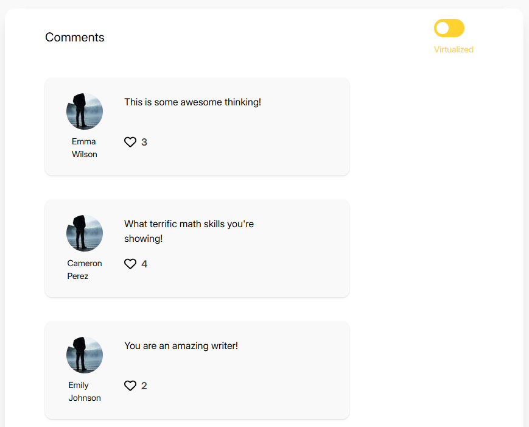
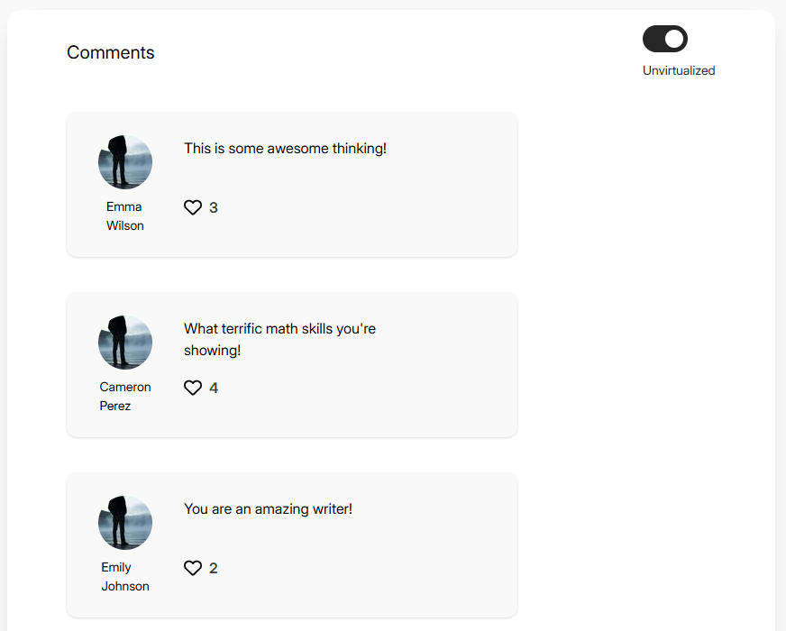

React Comment Section Demo
A simple demonstration of virtualized vs. non-virtualized comment rendering in React with TanStack Virtual.

Overview:

This project showcases the performance difference between virtualized and traditional rendering approaches when displaying large lists of comments. Toggle between the two modes to experience how virtualization improves scrolling performance and reduces memory usage.

Features:

🔄 Toggle between rendering modes - Switch between virtualized and non-virtualized lists
📊 Performance comparison - See the difference in scrolling smoothness and memory usage
👤 Realistic comment data - Uses DummyJSON.com API for realistic user profiles and comments
📱 Responsive design - Works across different screen sizes

Tech Stack:

- React
- TanStack Query for data fetching
- TanStack Virtual for efficient list rendering
- DummyJSON.com for demo data
